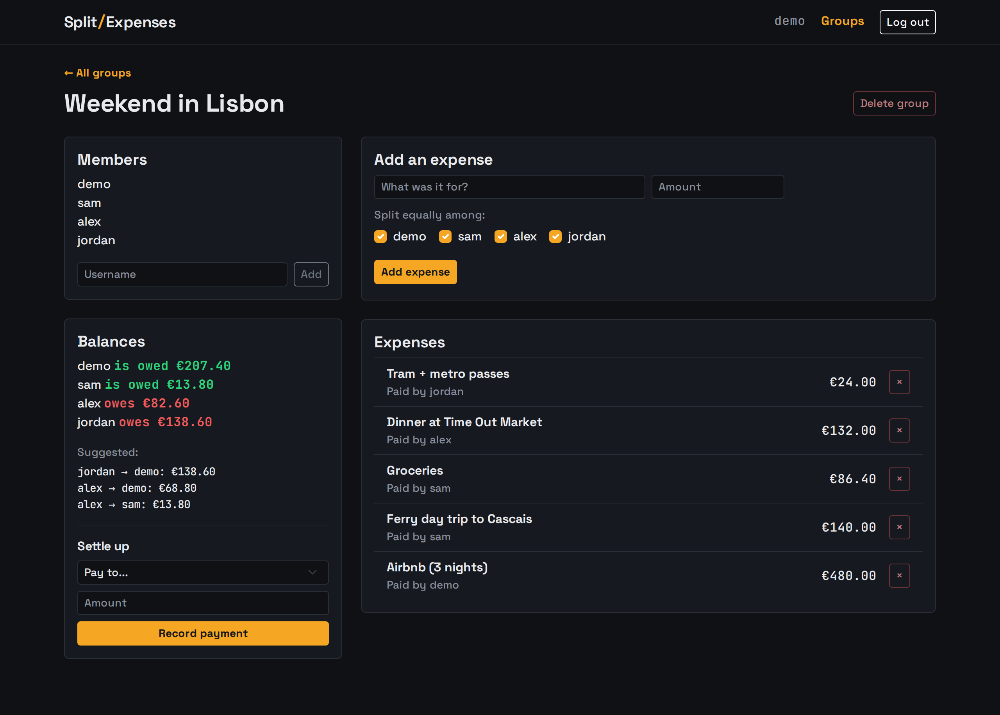
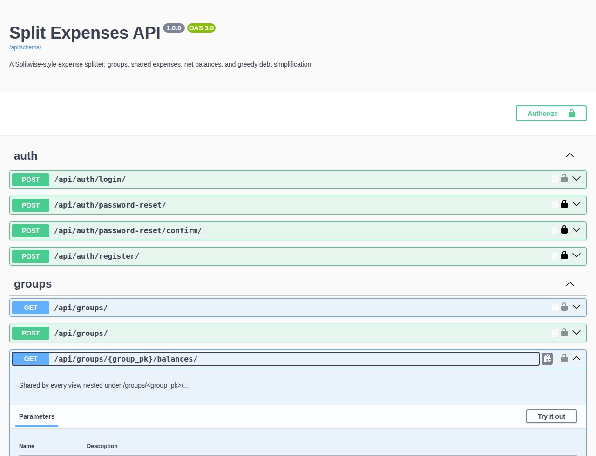

# Split Expenses

[](https://github.com/pamm-bot/django-expense-splitter/actions/workflows/ci.yml)

[English](README.md) · **Français**

Un séparateur de dépenses façon Splitwise : on crée un groupe, on enregistre les
dépenses partagées et on voit qui doit combien — avec un algorithme de
simplification des dettes qui calcule le plus petit nombre de virements pour
solder tout le monde.

Construit comme une API REST (Django REST Framework) avec un petit front-end en JS
qui la consomme en HTTP, plutôt qu'une seule application rendue côté serveur — les
deux côtés ne communiquent qu'à travers les mêmes endpoints JSON qu'utiliserait un
client externe.

**Démo en ligne :** https://split-expenses-pam-05e9be4c8938.herokuapp.com/ —
connecte-toi avec `demo` / `demo12345` pour un groupe pré-rempli, ou crée ton
propre compte.

## Captures d'écran

| Page d'un groupe | Documentation de l'API |
|---|---|
| [](docs/screenshots/group-detail.png) | [](docs/screenshots/api-docs.png) |

## Fonctionnalités

- **Comptes** — authentification par token ; inscription et connexion via l'API,
  avec réinitialisation du mot de passe par e-mail en cas d'oubli
- **Groupes** — créer un groupe, ajouter des membres par nom d'utilisateur
- **Dépenses** — enregistrer ce qui a été payé et par qui, partagé à parts égales
  entre les membres ou avec des montants personnalisés par personne
- **Soldes** — solde net par membre, calculé à partir de chaque dépense et de
  chaque remboursement du groupe
- **Simplification des dettes** — un algorithme glouton réduit les dettes du
  groupe au nombre minimal de virements pour les solder, au lieu que tout le monde
  rembourse tout le monde
- **Settle up** — enregistrer un paiement direct entre deux membres

## Stack

- Django 6.1, Django REST Framework, PostgreSQL
- Authentification par token (`rest_framework.authtoken`), avec limitation de débit
  ciblée sur les endpoints d'authentification
- Schéma OpenAPI 3 + Swagger UI via `drf-spectacular`
- WhiteNoise pour les fichiers statiques, `django-cors-headers` pour l'accès à
  l'API cross-origin
- Front-end en JavaScript pur (fetch sur l'API JSON, aucune étape de build)
- pytest pour les tests
- Déployé sur Heroku

## Choix techniques

- **API-first, pas de rendu serveur.** Le front-end n'est qu'un client de plus de
  l'API JSON — il n'a aucun accès privilégié à la base de données. Ça garde le
  contrat honnête et signifie que les mêmes endpoints serviraient une application
  mobile ou une intégration tierce sans changement.
- **La logique des soldes vit dans [`expenses/services.py`](expenses/services.py).**
  Transformer un tas de dépenses et de remboursements en « qui doit quoi, en un
  minimum de paiements » est la seule vraie logique métier ici, donc elle réside
  dans des fonctions simples, testées unitairement à part, loin des vues, des
  serializers et de l'ORM.
- **Simplification gloutonne des dettes.** On règle de façon répétée le plus gros
  créancier contre le plus gros débiteur. Ça ne trouve pas toujours le minimum
  théorique (ce problème est NP-difficile), mais c'est simple, prévisible, et en
  pratique ça donne `n - 1` paiements ou moins pour un groupe de `n`.
- **L'argent est un `Decimal` de bout en bout**, et l'endpoint des soldes
  sérialise les montants en chaînes de caractères — sinon le renderer JSON de DRF
  les ferait transiter par des `float`, ce qu'on ne veut surtout pas pour de la
  monnaie.
- **Auth par token plutôt que sessions/JWT.** L'API est sans état et consommée par
  un client de type script ; l'`authtoken` intégré de DRF est le minimum de
  machinerie qui fait le travail. Les endpoints d'authentification sont limités en
  débit pour que les routes de connexion et de réinitialisation ne puissent pas
  être martelées.
- **Front-end en JavaScript pur.** Aucune étape de build, aucun framework — juste
  de quoi exercer l'API et garder le repo centré sur le back-end. Le script de
  chaque page vit dans son propre fichier sous [`static/js/`](static/js/).

## Aperçu de l'API

| Endpoint | Méthode | Description |
|---|---|---|
| `/api/auth/register/` | POST | Créer un compte |
| `/api/auth/login/` | POST | Obtenir un token d'authentification |
| `/api/auth/password-reset/` | POST | Demander un e-mail de réinitialisation |
| `/api/auth/password-reset/confirm/` | POST | Définir un nouveau mot de passe depuis le lien reçu par e-mail |
| `/api/groups/` | GET, POST | Lister / créer tes groupes |
| `/api/groups/<id>/` | GET, PATCH, DELETE | Détail d'un groupe (suppression : créateur uniquement) |
| `/api/groups/<id>/members/` | POST | Ajouter un membre par nom d'utilisateur |
| `/api/groups/<id>/expenses/` | GET, POST | Lister / enregistrer des dépenses |
| `/api/groups/<id>/expenses/<id>/` | GET, DELETE | Détail / suppression d'une dépense |
| `/api/groups/<id>/settlements/` | GET, POST | Lister / enregistrer des remboursements |
| `/api/groups/<id>/balances/` | GET | Soldes nets + virements suggérés |
| `/api/schema/` | GET | Schéma OpenAPI 3 (YAML) |
| `/api/docs/` | GET | Swagger UI, parcourir et essayer l'API |

Tous les endpoints sauf register/login exigent d'être membre du groupe et un
en-tête `Authorization: Token <token>`. Les endpoints d'authentification sont
limités en débit (login et register 20/heure, demandes de réinitialisation
5/heure, par IP client).

## Exemple de flux

```bash
BASE=http://localhost:8000

# Créer deux comptes
curl -s $BASE/api/auth/register/ -H 'Content-Type: application/json' \
  -d '{"username": "alice", "email": "alice@example.com", "password": "hunter2!!"}'
curl -s $BASE/api/auth/register/ -H 'Content-Type: application/json' \
  -d '{"username": "bob", "password": "hunter2!!"}'

# Se connecter en tant qu'alice et récupérer son token
TOKEN=$(curl -s $BASE/api/auth/login/ -H 'Content-Type: application/json' \
  -d '{"username": "alice", "password": "hunter2!!"}' | python3 -c 'import sys,json; print(json.load(sys.stdin)["token"])')
AUTH="Authorization: Token $TOKEN"

# Créer un groupe et ajouter bob
GID=$(curl -s $BASE/api/groups/ -H "$AUTH" -H 'Content-Type: application/json' \
  -d '{"name": "Voyage en Sicile"}' | python3 -c 'import sys,json; print(json.load(sys.stdin)["id"])')
curl -s $BASE/api/groups/$GID/members/ -H "$AUTH" -H 'Content-Type: application/json' \
  -d '{"username": "bob"}'

# Alice paie 60.00, partagé à parts égales entre alice et bob
curl -s $BASE/api/groups/$GID/expenses/ -H "$AUTH" -H 'Content-Type: application/json' \
  -d '{"description": "Courses", "amount": "60.00", "split_equally_among": ["alice", "bob"]}'

# Voir qui doit quoi, plus les virements minimaux suggérés
curl -s $BASE/api/groups/$GID/balances/ -H "$AUTH"

# Bob règle ses 30.00 à alice (les remboursements sont enregistrés par le payeur,
# donc cet appel utilise le token de bob)
BOB_TOKEN=$(curl -s $BASE/api/auth/login/ -H 'Content-Type: application/json' \
  -d '{"username": "bob", "password": "hunter2!!"}' | python3 -c 'import sys,json; print(json.load(sys.stdin)["token"])')
curl -s $BASE/api/groups/$GID/settlements/ -H "Authorization: Token $BOB_TOKEN" -H 'Content-Type: application/json' \
  -d '{"paid_to": "alice", "amount": "30.00"}'
```

Pour un partage personnalisé, envoie `shares` au lieu de `split_equally_among` —
une liste de `{"user": "<username>", "amount": "<valeur>"}` dont la somme doit
égaler le montant de la dépense.

## Installation

```bash
python3 -m venv venv
source venv/bin/activate
pip install -r requirements-dev.txt
cp .env.example .env   # puis éditer SECRET_KEY, DATABASE_URL, etc.
python manage.py migrate
python manage.py seed_demo   # optionnel : un groupe « Weekend in Lisbon » pré-rempli
python manage.py runserver
```

`seed_demo` crée le login `demo` / `demo12345` et un groupe avec quelques dépenses
et un remboursement, pour que les vues des soldes et des paiements suggérés aient
quelque chose à montrer. La commande peut être relancée sans risque — elle
réinitialise ces données.

Les e-mails de réinitialisation de mot de passe demandent un compte Gmail avec un
[mot de passe d'application](https://myaccount.google.com/apppasswords)
(`EMAIL_HOST_USER` / `EMAIL_HOST_PASSWORD` dans `.env`) — facultatif en local, les
demandes de réinitialisation ne partent simplement pas sans lui.

Le front-end est servi par la même application à la racine `/`.

## Tests

```bash
pytest
```

S'exécutent automatiquement à chaque push et pull request via GitHub Actions.

## Qualité du code

```bash
black .      # formatage
flake8 .     # linting
python manage.py check --deploy   # réglages de sécurité pour la production
```
